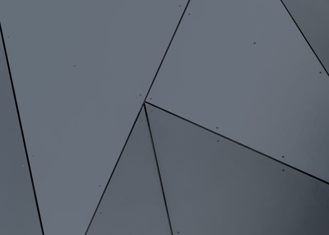

記事のバナー、アイキャッチ画像([Academic](https://sourcethemes.com/academic/) 的には [Featured image](https://sourcethemes.com/academic/docs/managing-content/#featured-image))があると書く時のテンションが上がるので、
出来るだけ設定するようにしたい。

でも出来るだけ手間はかけたくない…、そんな時に使っているサービスを順不同で挙げる。

なお、いずれのサービスにおいても、 `geometric` (幾何学模様)や
`abstract` (抽象的)、あるいは `network` や `programming` といったワードで検索すると、
いわゆる _いい感じ_ な画像がヒットする。

## Unsplash {#unsplash}

[Notion](https://www.notion.so/) のカバーイメージ選択欄にあったので存在を知った。



[License | Unsplash](https://unsplash.com/license)

[FAQ ページ](https://help.unsplash.com/en/articles/2612315-can-i-use-unsplash-photos-for-personal-or-commercial-projects) より引用:

> The photos on Unsplash are free to use and can be used for most commercial, personal projects, and for editorial use.

## Pexels {#pexels}



[License of our free stock photos - Pexels](https://www.pexels.com/photo-license/)

[FAQ ページ](https://www.pexels.com/ja-jp/faq/) より引用:

> Yes, all photos and videos are free for commercial use. You can use them on your commercial website, blog, product or anywhere else.

<!--quoteend-->

> すべての写真や動画は、商業コンテンツの一部として無料で利用できます。商業用のWebサイト、ブログ、製品、その他どんな場所にでも利用可能です。

## Pixabay {#pixabay}

Image by <a href="https://pixabay.com/users/geralt-9301/?utm_source=link-attribution&amp;utm_medium=referral&amp;utm_campaign=image&amp;utm_content=3064515">Gerd Altmann</a> from <a href="https://pixabay.com/?utm_source=link-attribution&amp;utm_medium=referral&amp;utm_campaign=image&amp;utm_content=3064515">Pixabay</a>

[Pixabay License](https://pixabay.com/service/license/)

[FAQ ページ](https://pixabay.com/service/faq/) より引用:

> You can copy, modify, distribute, and use the images, even for commercial purposes, all without asking for permission or giving credits to the artist. However, depicted content may still be protected by trademarks, publicity or privacy rights.

<!--quoteend-->

> これらの画像は、商用、非商用を問わず、コピー、改変、再配布することができます。利用に関する許諾や使用料の支払いは必要ありません。しかし、画像の中には商標やパブリシティ権、プライバシー権などに基づき保護されているものが含まれます。
